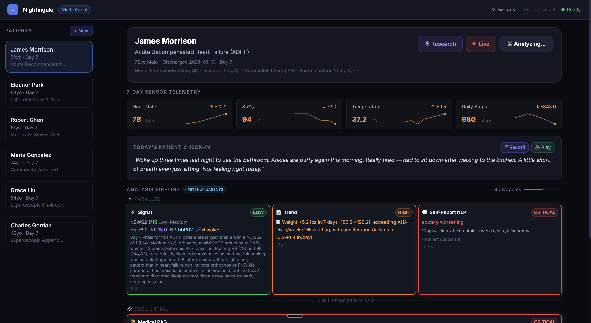
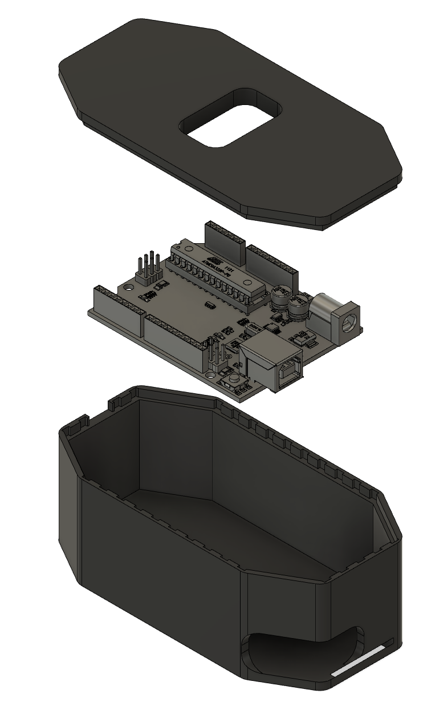

# Nightingale

AI-powered post-discharge patient monitoring. An 8-agent pipeline detects early clinical deterioration across live vitals, sensor trends, and patient language — and escalates with a structured clinical handoff before it becomes an emergency.

**Backend:** FastAPI + Python &nbsp;|&nbsp; **Frontend:** Vanilla JS, single HTML file &nbsp;|&nbsp; **LLM:** Claude Opus 4.8



---

## The problem

Patients discharged from hospital are at highest readmission risk in the first 7 days. Point-in-time vitals miss the patients who slide *slowly* — resting HR creeping up, sleep fragmenting, activity falling, self-reports quietly minimizing. Five signals each drifting a little can't all be coincidence at once.

Nightingale surfaces convergent deterioration, then makes a skeptic agent argue against escalation to fight alert fatigue, before a reconciler judge weighs both sides and makes a governed decision.

---

## 8-Agent Pipeline

```
┌──────────────┐  ┌──────────────┐  ┌──────────────────┐
│ Signal Agent │  │  Trend Agent  │  │ Self-Report NLP  │   ← parallel (Fetch.ai uAgents)
└──────┬───────┘  └──────┬───────┘  └────────┬─────────┘
       └─────────────────┴───────────────────┘
                         │ all findings
                         ▼
              ┌──────────────────────┐
              │  Medical RAG Agent   │   ← PubMed/NIH knowledge retrieval
              └──────────┬───────────┘
                         ▼
              ┌──────────────────────┐
              │  Adversarial Skeptic │   ← hypothesis → rebuttal debate rounds
              └──────────┬───────────┘
                         ▼
              ┌──────────────────────┐
              │  Reconciler / Judge  │   ← rules on each debate round, risk 0–100
              └──────────┬───────────┘
                         ▼
              ┌──────────────────────┐
              │  Clinical Brief      │   ← SBAR handoff document
              └──────────┬───────────┘
                         ▼
              ┌──────────────────────┐
              │  Escalation Agent    │   ← Fetch.ai fire-and-forget handoff
              └──────────────────────┘
```

---

## Sponsor Integrations

### Fetch.ai uAgents
Every pipeline stage is a real `uagents.Agent` running in a local `Bureau`. The 3 parallel analysis agents receive a `TriggerStage` message and send their `StageResult` back to the Coordinator. The sequential chain (RAG → Skeptic → Reconciler → Brief) runs inline on the Coordinator via `asyncio.to_thread` — no extra message round-trips. Escalation is fire-and-forget: the pipeline signals done the moment Brief completes.

All agent addresses are deterministic ed25519 keypairs derived from seeds (same format as Agentverse cloud agents). No network required — adding `endpoint=` and Almanac registration would make them discoverable globally with no other code changes.

### Arize
OpenTelemetry tracing (via `arize.otel`) wraps the full pipeline span and each agent step; the Anthropic SDK is auto-instrumented so every Claude call appears as a span in **Arize AX**. On top of the traces, an **LLM-as-judge evaluator** scores every run (clinical soundness + SBAR quality) and logs the verdict back as feedback — which we used to find and fix a real agent failure (see [Arize observability](#arize-observability-sponsor-track) below). No-op unless `ARIZE_API_KEY` or `ENABLE_TRACING` is set.

### Band
Governance fallback when running without the Fetch mesh. `BandRoom.deliberate()` runs one bounded Skeptic→Reconciler round. `escalation_gate()` performs a human-in-the-loop authority check. Append-only `AuditLog` records every consequential decision timestamped and serialized to JSON.

---

## Stack

| Layer | Technology |
|---|---|
| Backend | FastAPI, Python 3.11+ |
| LLM | Claude Opus 4 (`claude-opus-4-8`) |
| Agent mesh | Fetch.ai `uagents` |
| Observability | Arize Phoenix / OpenTelemetry |
| Governance | Band Protocol |
| Frontend | Vanilla JS + HTML/CSS (no build step) |
| Streaming | Server-Sent Events (SSE) |
| Voice | Deepgram STT + TTS |
| Web research | Browserbase + PubMed/NIH scraping |
| Hardware | Arduino (optional — tilt + light sensors) |

---

## Setup

```bash
git clone https://github.com/Jason2657/recovery-monitor.git
cd recovery-monitor
pip install -r requirements.txt
cp .env.example .env   # add your keys
python app.py          # → http://localhost:8000
```

### Environment variables

```bash
ANTHROPIC_API_KEY=...          # required

# Optional
DEEPGRAM_API_KEY=...           # voice input / TTS
BROWSERBASE_API_KEY=...        # web research via Browserbase
BROWSERBASE_PROJECT_ID=...
ARIZE_API_KEY=...              # Arize cloud tracing
ENABLE_TRACING=true            # local Phoenix tracing (run `phoenix serve` first)
ANTHROPIC_MODEL=...            # override model (default: claude-opus-4-8)
```

---

## Patients

Six built-in synthetic patients covering distinct clinical scenarios:

| Patient | Condition | Expected outcome |
|---|---|---|
| James Morrison (PT-7421) | CHF decompensation | **Escalate** — fluid overload, NEWS2 rising |
| Eleanor Park (PT-3892) | Post-TKA surgical site infection | **Escalate** — fever 38.9°C, spreading infection |
| Robert Chen (PT-5163) | COPD exacerbation recurrence | **Escalate** — SpO2 87%, RR 27, rescue inhaler ×5/day |
| Maria Gonzalez (PT-8427) | Post-pneumonia deterioration | **Escalate** — fever + declining sats |
| Grace Liu (PT-2048) | Post-lap-chole (elective) | **No escalation** — uneventful recovery, Skeptic wins |
| Charles Gordon (PT-1847) | Post-appendectomy | **No escalation** — textbook recovery, all vitals normal |

Custom patients can be created through the UI with a 7-day vitals wizard (supports voice entry via Deepgram).

---

## Terminal demo

```bash
python run_demo.py --patient PT-7421          # CHF (escalates)
python run_demo.py --patient PT-1847          # Charles Gordon (no escalation)
python run_demo.py --patient PT-7421 --mesh   # run via Fetch.ai Bureau
python run_demo.py --list                     # show all patients

python -m mesh.fetch_mesh                     # print all uAgent addresses
```

---

## Arize observability (sponsor track)

Every pipeline run is traced to **Arize AX** (app.arize.com), and a deterministic
**LLM-as-judge** scores each run and logs the verdict as feedback onto the trace —
which we then used to find and fix a real bug. Mapped to the judging criteria:

**1 · Integrated correctly.** [`observability/tracing.py`](observability/tracing.py)
calls `arize.otel.register(...)` and OpenInference auto-instruments the Anthropic SDK,
so each run is one trace: a `pipeline` root span → a span per agent (`agent.signal` …
`agent.brief`, `band.deliberate`, `band.escalation_gate`) → an auto-captured child
span for every Claude call. Set `ARIZE_API_KEY` + `ARIZE_SPACE_ID` +
`ARIZE_PROJECT_NAME` (project `nightingale`); falls back to Phoenix, else a clean no-op.

**2 · Meaningful trace data.** Each run emits ~15–20 spans (8 agent spans + the
auto-instrumented Claude LLM spans, with prompts / responses / token usage).
`scripts/eval_suite.py` traces every patient in one command.

**3 · An evaluator.** [`observability/llm_judge.py`](observability/llm_judge.py) is an
LLM-as-judge (`claude-sonnet-4-6`, **temperature 0** — independent of the pipeline's
opus model, so scores are reproducible). It grades each run on two dimensions and
attaches `eval.clinical_soundness.*` and `eval.sbar_quality.*` to the run's span via
`ArizeClient().spans.update_evaluations(...)`:
- **clinical_soundness** — is the Reconciler's risk / escalation / urgency calibrated
  and justified by the evidence (no alarm-fatigue, no missed deterioration)?
- **sbar_quality** — is the clinician SBAR handoff complete, specific, urgency-aware,
  and free of hallucinated facts?

**4 · Used the feedback to improve the app.** Both fixes were surfaced by the evals/traces:
- **Major — Medical Knowledge (RAG) agent.** The `clinical_soundness` critiques + traces
  kept showing the Reconciler "capping confidence due to a failed / UNKNOWN knowledge
  stream." The traces revealed the **RAG agent was silently failing to parse on ~70% of
  runs** — adaptive thinking + a large guideline JSON blew past its 4000-token cap,
  truncating the output → `severity: "unknown"`. We raised the budget; **parse-failure
  dropped ~70% → 0%**, recovering a full evidence stream (8–11 guideline citations/patient).
- **Minor — SBAR hallucination.** The `sbar_quality` judge flagged ungrounded
  extrapolations ("temp >38 °C in ~2 days") and generic stats in the handoff. We added
  GROUNDING RULES to the SBAR prompt; the ungrounded claims disappeared.

**Generate the artifact judges inspect:**
```bash
# .env: ARIZE_API_KEY, ARIZE_SPACE_ID, ARIZE_PROJECT_NAME=nightingale
python scripts/eval_suite.py --tag baseline    # all patients -> traces + evals in Arize
python scripts/eval_suite.py --tag improved    # after a fix, to compare
```
Then open **app.arize.com → project `nightingale`**: per-run traces (agent + Claude
spans) each carrying the two eval labels.

> Local alternative (no account): `pip install arize-phoenix && phoenix serve`, then `ENABLE_TRACING=1`.

## The self-correction loop (bonus feedback mechanism)

A second, deterministic loop nudges one `RISK_THRESHOLD` knob: each patient carries a
`ground_truth_escalate` label; a false alarm **raises** the threshold (be calmer), a
missed deterioration **lowers** it (be keener). Run the benign decoy (`PT-2048`) to see it.

## Tests

```bash
pip install pytest && pytest -q
```

Covers the governance gate + audit, the bounded deliberation round, the
self-correction knob, the tracing no-op fallback, and the Fetch uAgent addresses
(16 tests, no API key required).

## Repo layout

```
config.py            model + Anthropic client + the RISK_THRESHOLD knob
schemas.py           pydantic governance contract (RiskAssessment, GateDecision, AuditRecord, …)
agents.py            the 8 agent bodies + the governed run_full_pipeline orchestrator
patient_data.py      synthetic patients + clinical knowledge base
band/                Band governance: audit · room (deliberate + gate) · adapter
observability/       Arize: tracing · llm_judge (LLM-as-judge eval) · evaluator (self-correction)
scripts/eval_suite.py runs the judge across all patients -> traces + evals in Arize
mesh/                Fetch.ai uAgents Bureau (real message-passing workers)
run_demo.py          sponsor-aware terminal demo
main.py              brief terminal runner
app.py               FastAPI web backend (SSE + Deepgram + Arduino reader)
web_research.py      PubMed/NIH + Browserbase web research
static/index.html    web UI (single file, no build step)
tests/               governance / evaluator / tracing / mesh / import tests
```

---

## How the debate works

The **Skeptic** generates structured debate rounds — each with a benign hypothesis explaining why the patient is probably fine. The **Reconciler** receives the full transcript and rules on each round explicitly (`accepted` / `overruled`) with reasoning. The UI renders the full back-and-forth with color-coded rulings and a final verdict.

Risk scores below `RISK_THRESHOLD` (default 0.5) suppress escalation. The Arize self-correction loop adjusts this threshold automatically based on ground-truth outcomes.

---

## Hardware (optional)

An Arduino with a tilt sensor and photoresistor plugs in over serial. Tilt events track sleep movement and disturbance counts. The photoresistor detects light-on wake events. Both feed into the live vitals stream at `/api/live/{patient_id}` and appear in the Signal agent's analysis.


